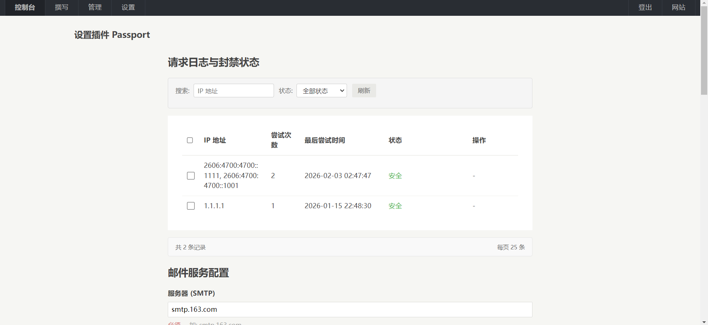

# 🛡️ Passport - Typecho 密码找回插件

> **Passport** 是一款为 Typecho 博客系统设计的安全插件。
>
> 插件提供安全的密码找回与重置功能。插件**内置零配置图片验证码**，同时支持多种主流第三方人机验证方式。内置严格的 Token 管理、HMAC 签名机制以及**支持 CDN 环境**的高级防爆破功能。本项目遵循 GPLv2 协议，完全免费开源。

[](https://github.com/little-gt/PLUGION-Passport/)
[](https://www.gnu.org/licenses/old-licenses/gpl-2.0.html)
[](https://www.php.net/)
[](https://typecho.org/)
[](https://garfieldtom.cool/)

界面预览：




参与讨论：

[Typecho 官方论坛主题帖](https://forum.typecho.org/viewtopic.php?t=25549)

---

## ✨ 特点概览

| 特性 | 描述 |
| :--- | :--- |
| **开箱即用验证码** | **内置动态图片验证码**（默认启用），无需申请 Key，同时也支持 reCAPTCHA、hCaptcha 和 Geetest。|
| **CDN/反代支持** | 支持自定义 **IP 获取策略**（代理头/自定义Header），在 Cloudflare 等 CDN 环境下也能精准识别真实 IP。|
| **防暴力破解** | 基于 IP 的请求速率限制和自动临时封禁，有效抵御暴力破解和邮件滥用。|
| **强密码策略** | 强制要求新密码包含大写、小写、数字及特殊字符。|
| **专业兼容性** | 插件架构遵循 Typecho 最佳实践，兼容 PHP 7.2+ 及 Typecho 1.2.1 和 1.3.0。|
| **可视化管理** | 🆕 后台提供**风险日志预览**、**密码重置历史记录**和一键解封功能，支持自定义Token保留天数，轻松配置各种找回密码的高级安全功能和邮件模板，提供简单且高度定制化的体验。|
| **高安全令牌机制** | 🆕 基于 **UID + 时间戳 + 32位随机字符串** 的组合进行 SHA256 哈希生成令牌，配合 HMAC-SHA256 签名校验，彻底杜绝重复使用风险和可预测性。|

---
## 🚀 近期更新

### 🛠️ 0.1.6 版本更新说明

本次更新为常规版本维护，包含多项功能增强和安全优化：

* 升级 PHPMailer 到最新版本

* 增强内置验证码的比较安全性，防御时序漏洞

---

## ⚙️ 安装指南

完成下面操作，找回密码功能，才能通过路由 `/passport/forgot` 和 `/passport/reset` 访问，并通过登录页面的“忘记密码”按钮访问。

### 📦 安装到 Typecho

1. **下载插件**
   ```bash
   git clone https://github.com/little-gt/PLUGION-Passport.git
   ```
   或直接下载 ZIP 压缩包上传至：
   ```
   /usr/plugins/Passport/
   ```

2. **启用插件**

   * 登录 Typecho 后台 -> 插件 → 启用 Passport - “密码找回插件”

3. **配置插件**

   *  根据提示进入插件配置页面，完成以下关键设置：
      -  **IP 识别策略**：如果您使用了 CDN，请务必选择“代理头”或配置“自定义请求头”。
      -  **SMTP 服务信息**：(必填) 用于发送重置邮件。
      -  **人机验证**：默认使用“内置图片验证码”，无需额外配置。如有需要也可切换至 Google/Geetest 等服务。
      -  **安全密钥**：检查并保存自动生成的 HMAC 安全密钥。

### 📌 集成到登录页

若要在 Typecho 默认登录页 (`admin/login.php`) 添加“忘记密码”链接，请参考以下代码并手动插入到相应模板文件：

```php
// 找到这里 (位于 admin/login.php 底部)
<?php if($options->allowRegister): ?>
&bull;
<a href="<?php $options->registerUrl(); ?>"><?php _e('用户注册'); ?></a>
<?php endif; ?>

// 在其下方插入以下代码
<?php
   $activates = array_keys(Typecho_Plugin::export()['activated']);
   if (in_array('Passport', $activates)) {
       echo '&bull; <a href="' . Typecho_Common::url('passport/forgot', $options->index) . '">' . '忘记密码' . '</a>';
   }
?>
```

---

## 💬 技术支持

如有问题，请访问：
- **问题反馈**：https://github.com/little-gt/PLUGION-Passport/issues
- **作者主页**：https://garfieldtom.cool/

---

**Passport 插件** — 为你的博客添加一个安全强大的密码找回功能。