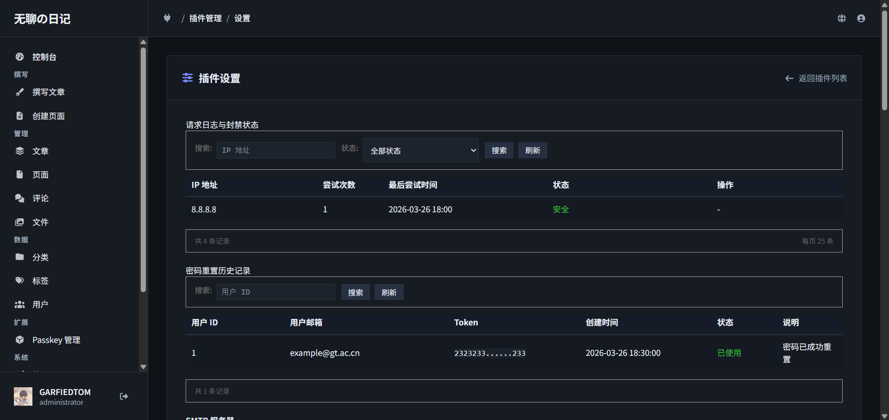
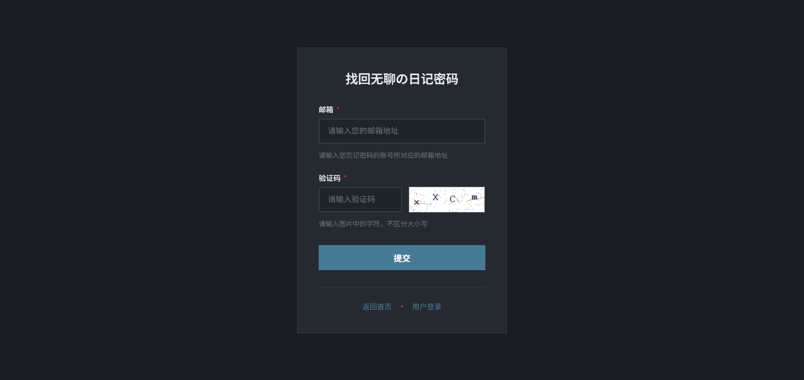
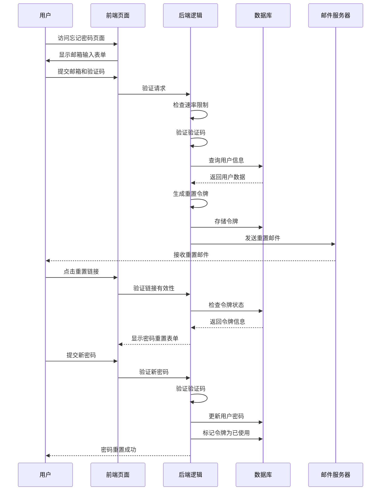

# Passport 密码找回插件 for Typecho

Passport 是一款为 Typecho 博客系统设计的安全插件。

插件提供安全的密码找回与重置功能。插件内置零配置图片验证码，同时支持多种主流第三方人机验证方式。内置严格的 Token 管理、HMAC 签名机制以及支持 CDN 环境的高级防爆破功能。本项目遵循 GPLv2 协议，完全免费开源。

[](https://github.com/garfieldtom/PLUGION-Passport)
[](https://www.php.net/)
[](https://opensource.org/licenses/GPL-2.0)

## 📷 预览图

### 后台管理界面


### 密码找回页面


## 📦 项目简介

**Passport** 是为 Typecho 博客系统开发的专业密码找回插件，提供安全可靠的密码重置功能，集成多种人机验证机制，支持防暴力破解和 IP 速率限制。

### 🚀 核心特性

- **安全可靠**：采用 HMAC 签名验证，确保密码重置链接的安全性
- **多种验证码**：支持内置图片验证码、Google reCAPTCHA、hCaptcha 和 Geetest
- **防暴力破解**：智能 IP 速率限制，自动封禁异常请求
- **邮件模板**：可自定义邮件模板，支持变量替换
- **详细日志**：完整的密码重置历史和请求日志记录
- **多主题适配**：完美适配 BooAdmin 等现代主题
- **响应式设计**：支持移动端和桌面端

## 📖 快速开始

### 安装方法

1. **下载插件**：从 GitHub 下载最新版本
2. **上传文件**：将插件解压到 Typecho 插件目录 `usr/plugins/`
3. **激活插件**：在 Typecho 后台插件管理中激活 Passport
4. **配置插件**：填写 SMTP 信息和其他配置项

### 基本配置

| 配置项 | 说明 | 默认值 |
|-------|------|-------|
| SMTP 服务器 | 邮件发送服务器地址 | smtp.example.com |
| SMTP 端口 | 邮件发送服务器端口 | 465 |
| SMTP 帐号 | 邮件发送账号 | noreply@example.com |
| SMTP 密码 | 邮件发送密码 | - |
| 加密类型 | SMTP 加密方式 | ssl |
| 验证码类型 | 人机验证方式 | 内置图片验证码 |
| HMAC 签名密钥 | 用于签名验证的密钥 | 自动生成 |
| 启用请求速率限制 | 防止暴力破解 | 启用 |

## 🛠 技术架构

### 系统流程图



### 目录结构

```
Passport/
├── Plugin.php           # 插件主文件，负责路由注册和配置
├── Widget.php           # 核心逻辑，处理密码重置流程
├── template/            # 前端模板
│   ├── forgot.php       # 忘记密码页面
│   ├── reset.php        # 重置密码页面
│   └── partial/         # 公共模板
│       ├── common.php   # 公共变量和初始化
│       ├── header.php   # HTML 头部
│       └── resource.php # 静态资源（CSS/JS）
└── PHPMailer/           # 邮件发送库
```

## 🔌 API 接口

### 1. 验证码接口

#### 请求信息
- **URL**: `/passport/captcha`
- **方法**: GET
- **参数**: 无

#### 响应
- **类型**: 图片/png
- **描述**: 返回验证码图片，同时将验证码存储在 Session 中

### 2. 忘记密码接口

#### 请求信息
- **URL**: `/passport/forgot`
- **方法**: POST
- **参数**:
  | 字段名 | 类型 | 必填 | 描述 |
  |-------|------|------|------|
  | mail | string | 是 | 用户邮箱 |
  | captcha | string | 是 | 验证码 |
  | do | string | 是 | 固定值 "mail" |

#### 响应
- **类型**: HTML
- **描述**: 显示操作结果，成功或失败信息

### 3. 重置密码接口

#### 请求信息
- **URL**: `/passport/reset`
- **方法**: POST
- **参数**:
  | 字段名 | 类型 | 必填 | 描述 |
  |-------|------|------|------|
  | token | string | 是 | 重置令牌 |
  | signature | string | 是 | HMAC 签名 |
  | password | string | 是 | 新密码 |
  | confirm | string | 是 | 确认密码 |
  | captcha | string | 是 | 验证码 |
  | do | string | 是 | 固定值 "password" |

#### 响应
- **类型**: HTML
- **描述**: 显示操作结果，成功或失败信息

### 4. IP 解封接口

#### 请求信息
- **URL**: `/action/passport-unblock`
- **方法**: POST
- **参数**:
  | 字段名 | 类型 | 必填 | 描述 |
  |-------|------|------|------|
  | unblock_ip | string | 是 | 要解封的 IP 地址 |
  | _ | string | 是 | CSRF 令牌 |

#### 响应
- **类型**: JSON
- **描述**: 返回操作结果

#### 响应示例
```json
{
  "success": true,
  "message": "IP [192.168.1.1] 已解封。"
}
```

## 🎨 主题适配

### BooAdmin 主题适配

Passport 插件完美适配 [BooAdmin](https://github.com/little-gt/THEME-BooAdmin) 主题，提供一致的视觉体验。

### 自定义主题适配

如果您使用的是自定义主题，可以通过以下方式确保 Passport 页面与主题风格一致：

1. **CSS 变量**：Passport 使用 CSS 变量定义颜色和样式，您可以在主题中覆盖这些变量
2. **模板修改**：如需深度定制，可以修改 `template/partial/resource.php` 中的样式
3. **通知系统**：Passport 内置统一的通知系统，可与主题通知系统集成

## 🔒 安全特性

- **HMAC 签名**：所有重置链接都使用 HMAC 签名验证，防止伪造
- **令牌管理**：令牌有过期时间，使用后立即失效
- **速率限制**：智能 IP 速率限制，防止暴力破解
- **验证码**：多种验证码选项，防止自动化攻击
- **Session 保护**：验证码验证后立即销毁，防止重放攻击
- **SQL 注入防护**：使用 Typecho 数据库抽象层，防止 SQL 注入
- **XSS 防护**：所有用户输入都经过过滤和转义

## 📊 日志系统

### 密码重置历史

Passport 记录所有密码重置操作，包括：
- 用户 ID 和邮箱
- 令牌创建时间
- 令牌状态（未使用/已使用/已过期）
- 操作结果

### 请求日志

记录所有密码重置请求，包括：
- IP 地址
- 尝试次数
- 最后尝试时间
- 封禁状态

## 📝 邮件模板

Passport 支持自定义邮件模板，您可以在后台配置中修改邮件内容。

### 默认模板变量

| 变量 | 描述 |
|------|------|
| {username} | 用户名称 |
| {sitename} | 网站名称 |
| {requestTime} | 请求时间 |
| {resetLink} | 重置链接 |

## 🚩 版本历史

| 版本 | 日期 | 主要变更 |
|------|------|----------|
| 1.0.1 | 2026-03-01 | 适配 BooAdmin 主题，优化通知系统，提升 SVG 图标质量 |
| 0.1.5 | 2025-12-01 | 增强 Token 安全性，添加密码重置历史审计功能 |
| 0.1.4 | 2025-10-15 | 新增 IP 拦截管理功能 |
| 0.1.3 | 2025-09-01 | 优化 IP 获取策略，增强验证码安全性 |
| 0.1.2-fix | 2025-08-10 | 修复安全漏洞，增强密码学安全性 |

## 🤝 贡献指南

我们欢迎社区贡献，包括：

- 代码优化和 bug 修复
- 新功能开发
- 文档完善
- 安全审计

请提交 Pull Request 或创建 Issue 来参与项目开发。

## 📄 许可证

Passport 插件采用 GNU General Public License v2.0 许可证。

## 📞 联系方式

- **作者**: GARFIELDTOM
- **网站**: https://garfieldtom.cool/
- **GitHub**: https://github.com/garfieldtom/PLUGION-Passport

---

**感谢使用 Passport 插件！** 如有任何问题或建议，请随时联系我们。