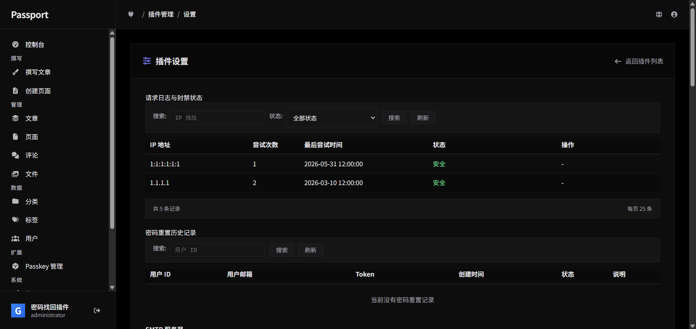
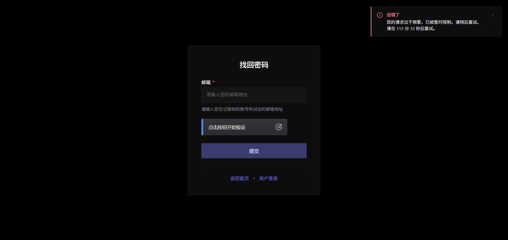
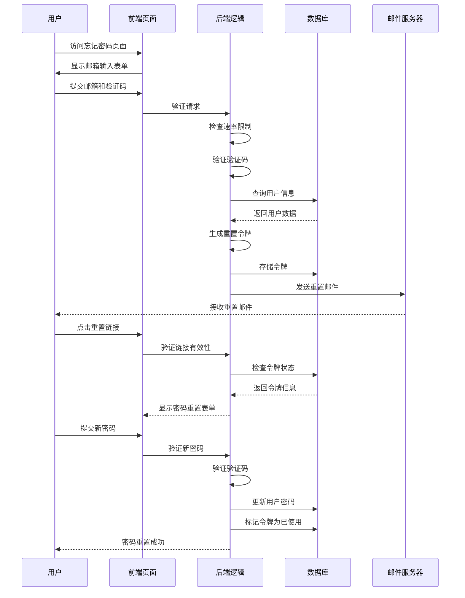

# Passport 密码找回插件 for Typecho

Passport 是一款为 Typecho 博客系统设计的安全插件。

插件提供安全的密码找回与重置功能。插件内置零配置图片验证码，同时支持多种主流第三方人机验证方式。内置严格的 Token 管理、HMAC 签名机制以及支持 CDN 环境的高级防爆破功能。本项目遵循 GPLv2 协议，完全免费开源。

[](https://github.com/little-gt/PLUGION-Passport)
[](https://www.php.net/)
[](https://opensource.org/licenses/GPL-2.0)

## 📷 预览图

### 后台管理界面


### 密码找回页面


## 📦 项目简介

**Passport** 是为 Typecho 博客系统开发的专业密码找回插件，提供安全可靠的密码重置功能，集成多种人机验证机制，支持防暴力破解和 IP 速率限制。

### 🚀 核心特性

- **安全可靠**：采用 HMAC 签名验证，确保密码重置链接的安全性
- **多种验证码**：支持内置图片验证码、Google reCAPTCHA、hCaptcha 和 Geetest
- **防暴力破解**：智能 IP 速率限制，自动封禁异常请求
- **邮件模板**：可自定义邮件模板，支持变量替换
- **详细日志**：完整的密码重置历史和请求日志记录
- **多主题适配**：完美适配 BooAdmin 等现代主题
- **响应式设计**：支持移动端和桌面端
- **独立通知系统**：Session 通知 + PRG 模式，脱离后台依赖 ✨ v1.0.2
- **智能验证码加载**：圆形加载指示器 + 平滑过渡动画 ✨ v1.0.2
- **现代化 UI**：Passkey 风格设计，半透明背景，主题色一致性 ✨ v1.0.2

## 📖 快速开始

### 安装方法

1. **下载插件**：从 GitHub 下载最新版本
2. **上传文件**：将插件解压到 Typecho 插件目录 `usr/plugins/`
3. **激活插件**：在 Typecho 后台插件管理中激活 Passport
4. **配置插件**：填写 SMTP 信息和其他配置项

### 基本配置

| 配置项 | 说明 | 默认值 |
|-------|------|-------|
| SMTP 服务器 | 邮件发送服务器地址 | smtp.example.com |
| SMTP 端口 | 邮件发送服务器端口 | 465 |
| SMTP 帐号 | 邮件发送账号 | noreply@example.com |
| SMTP 密码 | 邮件发送密码 | - |
| 加密类型 | SMTP 加密方式 | ssl |
| 验证码类型 | 人机验证方式 | 内置图片验证码 |
| HMAC 签名密钥 | 用于签名验证的密钥 | 自动生成 |
| 启用请求速率限制 | 防止暴力破解 | 启用 |

## 🛠 技术架构

### 系统流程图


```mermaid
sequenceDiagram
    participant User as 用户
    participant Frontend as 前端页面
    participant Backend as 后端逻辑
    participant DB as 数据库
    participant SMTP as 邮件服务器

    User->>Frontend: 访问忘记密码页面
    Frontend->>User: 显示邮箱输入表单
    User->>Frontend: 提交邮箱和验证码
    Frontend->>Backend: 验证请求
    Backend->>Backend: 检查速率限制
    Backend->>Backend: 验证验证码
    Backend->>DB: 查询用户信息
    DB-->>Backend: 返回用户数据
    Backend->>Backend: 生成重置令牌
    Backend->>DB: 存储令牌
    Backend->>SMTP: 发送重置邮件
    SMTP-->>User: 接收重置邮件
    User->>Frontend: 点击重置链接
    Frontend->>Backend: 验证链接有效性
    Backend->>DB: 检查令牌状态
    DB-->>Backend: 返回令牌信息
    Backend-->>Frontend: 显示密码重置表单
    User->>Frontend: 提交新密码
    Frontend->>Backend: 验证新密码
    Backend->>Backend: 验证验证码
    Backend->>DB: 更新用户密码
    Backend->>DB: 标记令牌为已使用
    Backend-->>User: 密码重置成功
```

### 目录结构

```
Passport/
├── Plugin.php           # 插件主文件，负责路由注册和配置
├── Widget.php           # 核心逻辑，处理密码重置流程
├── Template/            # 前端模板
│   ├── forgot.php       # 忘记密码页面
│   ├── reset.php        # 重置密码页面
│   └── partial/         # 公共模板
│       ├── common.php   # 公共变量和初始化
│       ├── header.php   # HTML 头部
│       └── resource.php # 静态资源（CSS/JS）
└── PHPMailer/           # 邮件发送库
```

### 核心技术实现

#### 1. 通知系统架构

Passport v1.0.2 采用独立的 Session 通知系统，完全脱离 Typecho 后台依赖：

**后端实现** (`Widget.php`)：
```php
// 存储通知到 Session
protected function pushNotice($message, $type = 'success', $countdown = null) {
    $_SESSION['passport_notice'] = [
        'message' => $message,
        'type' => $type,
        'countdown' => $countdown
    ];
}

// POST-Redirect-GET 模式防止表单重复提交
$this->pushNotice('操作成功', 'success');
$this->response->redirect($redirectUrl);
```

**前端渲染** (`resource.php`)：
- 使用 JSON 编码安全传递数据（`JSON_HEX_TAG | JSON_HEX_AMP | JSON_HEX_APOS | JSON_HEX_QUOT`）
- 采用 Passkey 风格设计：半透明背景 + 主题色文本
- 从上往下滑入动画（`translateY(-10px) → translateY(0)`）
- 智能倒计时：倒计时期间不自动关闭，结束后延迟 1 秒自动关闭

**CSS 特性**：
```css
.passport-toast.success {
    background-color: rgba(16, 185, 129, 0.1);  /* 半透明绿色背景 */
    border-color: #10b981;
    color: #10b981;  /* 主题色文本 */
}

@keyframes passkeySlideIn {
    from { opacity: 0; transform: translateY(-10px); }
    to { opacity: 1; transform: translateY(0); }
}
```

#### 2. 验证码加载机制

**智能加载指示器** (v1.0.2 新增)：

**HTML 结构**：
```html
<div class="passport-captcha-wrapper">
    <!-- 圆形加载指示器 -->
    <div class="passport-captcha-loader active"></div>
    <!-- 验证码图片（初始隐藏） -->
    
</div>
```

**加载流程**：
1. 页面首次加载：显示空白占位 + 旋转加载器
2. DOMContentLoaded 触发：自动调用 `refreshCaptcha()`
3. 图片开始加载：加载器保持显示，图片透明度为 0
4. 图片加载完成：移除 `.loading` 类，图片淡入显示，隐藏加载器
5. 点击刷新：重复步骤 2-4

**JavaScript 实现**：
```javascript
function refreshCaptcha(imgElement) {
    const wrapper = imgElement.parentElement;
    const loader = wrapper.querySelector('.passport-captcha-loader');
    
    // 显示加载器，隐藏图片
    imgElement.classList.add('refreshing', 'loading');
    loader.classList.add('active');
    
    // 动态设置图片源（支持首次加载）
    const baseUrl = imgElement.src || '/passport/captcha';
    imgElement.src = baseUrl + '?' + Math.random();
    
    // 加载完成：隐藏加载器，显示图片
    imgElement.onload = () => {
        imgElement.classList.remove('refreshing', 'loading');
        loader.classList.remove('active');
    };
}
```

**CSS 动画**：
```css
/* 圆形加载器 */
.passport-captcha-loader {
    width: 24px;
    height: 24px;
    border: 3px solid var(--passport-border);
    border-top-color: var(--passport-primary);
    border-radius: 50%;
    animation: passkeyRotate 0.8s linear infinite;
}

/* 图片加载状态 */
.passport-captcha-img.loading {
    opacity: 0;  /* 加载时透明 */
    pointer-events: none;  /* 禁用点击 */
}
```

#### 3. 前端技术栈

- **CSS 变量系统**：支持亮色/暗色主题自动切换
- **原生 JavaScript**：无外部依赖，轻量高效
- **SVG 图标**：24x24px 矢量图标，使用 `currentColor` 继承主题色
- **响应式布局**：移动端/桌面端/4K 屏幕完美适配
- **动画系统**：CSS3 过渡动画，流畅自然
- **Session 管理**：PHP Session 存储通知数据，PRG 模式防止重复提交

#### 4. 安全机制

- **Token 生成**：`SHA256(UID + Timestamp + random_bytes(32))`
- **HMAC 签名**：`hash_hmac('sha256', $token, $secret)`
- **验证码保护**：验证后立即销毁 Session，防止重放攻击
- **速率限制**：基于 IP 的滑动窗口算法
- **XSS 防护**：所有输出使用 `htmlspecialchars()` 转义
- **CSRF 防护**：Typecho 内置 Security 令牌验证

## 🔌 API 接口

### 1. 验证码接口

#### 请求信息
- **URL**: `/passport/captcha`
- **方法**: GET
- **参数**: 无
- **Headers**: 
  - `Cookie`: 必须携带 Session Cookie

#### 响应
- **类型**: `image/png`
- **大小**: 约 2-5 KB
- **尺寸**: 120x48 px
- **有效期**: Session 生命周期（默认 24 分钟）

#### 技术细节
- 使用 PHP GD 库动态生成
- 随机 4-6 位字符（数字 + 字母）
- 包含干扰线和噪点，防止 OCR
- 验证码存储在 `$_SESSION['captcha']`
- 验证后立即销毁（Verify-and-Destroy）

#### 示例请求
```bash
curl -X GET 'https://example.com/passport/captcha' \
  -H 'Cookie: PHPSESSID=abc123...' \
  --output captcha.png
```

#### 加载优化（v1.0.2）
- 首次访问自动加载（DOMContentLoaded 触发）
- 加载过程显示圆形旋转指示器
- 点击图片刷新，支持防重复点击
- 刷新时不旋转图片，仅显示加载指示器

### 2. 忘记密码接口

#### 请求信息
- **URL**: `/passport/forgot`
- **方法**: GET（显示表单） / POST（提交表单）
- **Content-Type**: `application/x-www-form-urlencoded`

#### POST 参数
| 字段名 | 类型 | 必填 | 验证规则 | 描述 |
|-------|------|------|----------|------|
| mail | string | 是 | Email 格式 | 用户注册邮箷 |
| captcha | string | 是 | 4-6 位字符 | 验证码（不区分大小写） |
| do | string | 是 | 固定值 `mail` | 操作类型标识 |

#### 响应类型
**成功情况**：
- **HTTP 状态**: 302 Found
- **Location**: `/passport/forgot`（重定向回表单页面）
- **Session**: 存储成功通知数据
- **通知消息**: “密码重置邮件已发送，请查收邮箱。”

**失败情况**：
- **HTTP 状态**: 302 Found
- **Session**: 存储错误通知数据
- **通知类型**: `error`
- **常见错误**：
  - “邮箱地址不存在”
  - “验证码错误”
  - “请求过于频繁，请 X 分钟后再试”（包含倒计时）

#### 技术流程
```
1. 验证请求频率（IP 速率限制）
2. 验证验证码（Session 匹配）
3. 验证邮箱格式（filter_var）
4. 查询用户是否存在
5. 生成重置 Token（SHA256）
6. 生成 HMAC 签名
7. 存储 Token 到数据库
8. 发送重置邮件（PHPMailer）
9. 存储通知到 Session
10. 重定向回表单页面（PRG 模式）
```

#### 示例请求
```bash
curl -X POST 'https://example.com/passport/forgot' \
  -H 'Content-Type: application/x-www-form-urlencoded' \
  -H 'Cookie: PHPSESSID=abc123...' \
  -d 'mail=user@example.com' \
  -d 'captcha=A3B9' \
  -d 'do=mail'
```

#### 安全机制
- 验证码验证后立即销毁
- IP 速率限制（5分钟3次）
- 邮箱枚举防护（不显示具体错误）
- Token 一次性使用
- HMAC 签名防篡改

### 3. 重置密码接口

#### 请求信息
- **URL**: `/passport/reset`
- **方法**: GET（验证链接并显示表单） / POST（提交新密码）
- **Content-Type**: `application/x-www-form-urlencoded`

#### GET 参数（邮件链接）
| 字段名 | 类型 | 必填 | 描述 |
|-------|------|------|------|
| token | string | 是 | 64 位重置令牌（SHA256） |
| signature | string | 是 | 64 位 HMAC 签名（SHA256） |

#### POST 参数
| 字段名 | 类型 | 必填 | 验证规则 | 描述 |
|-------|------|------|----------|------|
| token | string | 是 | 64 位十六进制 | 重置令牌 |
| signature | string | 是 | 64 位十六进制 | HMAC 签名 |
| password | string | 是 | 6-32 位 | 新密码 |
| confirm | string | 是 | 与 password 一致 | 确认密码 |
| captcha | string | 是 | 4-6 位字符 | 验证码 |
| do | string | 是 | 固定值 `password` | 操作类型标识 |

#### 响应类型
**成功情况**：
- **HTTP 状态**: 302 Found
- **Location**: 登录页面（Typecho 默认）
- **通知消息**: “密码重置成功，请使用新密码登录。”

**失败情况**：
- **HTTP 状态**: 302 Found
- **Location**: `/passport/reset?token=...&signature=...`
- **通知类型**: `error`
- **常见错误**：
  - “无效的重置链接”（Token 不存在）
  - “链接已失效”（Token 已过期或已使用）
  - “签名验证失败”（HMAC 不匹配）
  - “两次密码输入不一致”
  - “验证码错误”

#### 技术流程
```
GET 请求：
1. 验证 Token 和 Signature 参数存在
2. 验证 HMAC 签名（hash_equals）
3. 查询 Token 是否存在且未使用
4. 检查 Token 是否过期（24小时）
5. 显示密码重置表单

POST 请求：
1. 重复 GET 请求的验证步骤
2. 验证验证码
3. 验证新密码格式
4. 验证两次密码一致性
5. 更新数据库中的用户密码
6. 标记 Token 为已使用
7. 存储成功通知
8. 重定向到登录页面
```

#### 示例请求
**GET 请求（邮件链接）**：
```
https://example.com/passport/reset?
  token=a1b2c3d4e5f6...&
  signature=1a2b3c4d5e6f...
```

**POST 请求**：
```bash
curl -X POST 'https://example.com/passport/reset' \
  -H 'Content-Type: application/x-www-form-urlencoded' \
  -H 'Cookie: PHPSESSID=abc123...' \
  -d 'token=a1b2c3d4e5f6...' \
  -d 'signature=1a2b3c4d5e6f...' \
  -d 'password=NewPass123' \
  -d 'confirm=NewPass123' \
  -d 'captcha=X7Y9' \
  -d 'do=password'
```

#### 安全机制
- HMAC 签名验证（防篡改）
- Token 一次性使用（防重放）
- Token 24 小时过期
- 验证码二次验证
- 密码长度限制（6-32 位）
- 两次密码一致性检查

### 4. IP 解封接口

#### 请求信息
- **URL**: `/action/passport-unblock`
- **方法**: POST
- **参数**:
  | 字段名 | 类型 | 必填 | 描述 |
  |-------|------|------|------|
  | unblock_ip | string | 是 | 要解封的 IP 地址 |
  | _ | string | 是 | CSRF 令牌 |

#### 响应
- **类型**: JSON
- **描述**: 返回操作结果

#### 响应示例
```json
{
  "success": true,
  "message": "IP [192.168.1.1] 已解封。"
}
```

## 🎨 主题适配

### BooAdmin 主题适配

Passport 插件完美适配 [BooAdmin](https://github.com/little-gt/THEME-BooAdmin) 主题，提供一致的视觉体验。

### Passkey 插件适配

v1.0.2 版本通知系统采用与 [Passkey](https://github.com/little-gt/PLUGION-Passkey) 插件完全一致的视觉设计：
- 半透明主题色背景（`rgba(16, 185, 129, 0.1)` 用于成功通知）
- 从上往下滑入动画（`translateY(-10px) → translateY(0)`）
- 扁平化设计，无圆角无阴影
- 图标、文本、关闭按钮统一使用主题色

### 自定义主题适配

如果您使用的是自定义主题，可以通过以下方式确保 Passport 页面与主题风格一致：

1. **CSS 变量**：Passport 使用 CSS 变量定义颜色和样式，您可以在主题中覆盖这些变量
   ```css
   :root {
       --passport-primary: #your-color;
       --passport-success: #your-success-color;
       --passport-error: #your-error-color;
   }
   ```

2. **模板修改**：如需深度定制，可以修改 `Template/partial/resource.php` 中的样式
   - 通知系统样式从第 299 行开始
   - 验证码样式从第 202 行开始
   - CSS 变量定义从第 15 行开始

3. **通知系统**：Passport 使用 Session 通知系统，完全独立于主题
   - 前端使用 `PassportToast.show()` 方法显示通知
   - 支持四种类型：`success`、`error`、`warning`、`info`
   - 自动处理倒计时和自动关闭逻辑

4. **响应式断点**：
   - 移动端：`@media (max-width: 480px)`
   - 平板端：默认样式（481px - 1919px）
   - 高清屏：`@media (min-width: 1920px)`
   - 4K 屏幕：`@media (min-width: 2560px)`

## 🔒 安全特性

Passport 插件采用多层安全防护机制，确保密码重置流程的安全性：

### 1. HMAC 签名验证

**原理**：使用 HMAC-SHA256 算法对重置令牌进行签名，防止中间人攻击和链接伪造。

**实现细节**：
```php
// 生成签名
$signature = hash_hmac('sha256', $token, $hmacSecret);

// 验证签名
if (!hash_equals($expectedSignature, $providedSignature)) {
    throw new Exception('签名验证失败');
}
```

**安全优势**：
- 使用 `hash_equals()` 防止时间攻击
- 密钥由 `random_bytes(32)` 生成，具有很高的熵值
- 签名不可逆向，无法通过签名推导密钥

### 2. 令牌管理系统

**Token 生成算法**：
```php
$token = hash('sha256', 
    $uid .                      // 用户 ID
    time() .                    // 当前时间戳
    bin2hex(random_bytes(32))   // 32 字节密码学随机数
);
```

**生命周期管理**：
- **创建**：生成 Token 并存储到数据库，状态为 `unused`
- **验证**：检查 Token 是否存在、未过期、未使用
- **使用**：密码重置成功后，立即标记为 `used`
- **过期**：默认 24 小时后自动过期
- **清理**：定期清理已使用和过期的 Token

**安全特性**：
- Token 不可重复使用（一次性）
- Token 不可预测（高熵值随机）
- Token 有明确的过期时间

### 3. 速率限制机制

**滑动窗口算法**：基于 IP 地址的请求频率控制，防止暴力破解。

**限制策略**：
- **短期限制**：5 分钟内最多 3 次尝试
- **中期限制**：1 小时内最多 10 次尝试
- **封禁时间**：超限后封禁 1 小时

**IP 获取策略**（v0.1.3+）：
- 支持 CDN/反代环境
- 可配置 `X-Forwarded-For`、`X-Real-IP` 等 Header
- 防止 IP 伪造绕过限制

### 4. 验证码保护

**内置验证码**（默认）：
- 使用 PHP GD 库生成随机字符图片
- 支持数字 + 字母组合，不区分大小写
- 干扰线和噪点防止 OCR 识别
- 使用 `hash_equals()` 防止时序攻击

**Verify-and-Destroy 机制**（v0.1.3+）：
```php
// 验证验证码
if (!hash_equals($sessionCode, $inputCode)) {
    throw new Exception('验证码错误');
}

// 立即销毁，防止重放攻击
unset($_SESSION['captcha']);
```

**第三方验证码支持**：
- Google reCAPTCHA v2
- hCaptcha
- Geetest 行为验证

### 5. Session 安全

**Session 管理**：
- 使用 PHP 原生 Session 机制
- Session ID 由 PHP 自动生成（高安全性）
- 支持 Session 过期时间配置

**数据存储**：
- 验证码存储在 `$_SESSION['captcha']`
- 通知数据存储在 `$_SESSION['passport_notice']`（v1.0.2）
- 敏感数据使用后立即清除

### 6. SQL 注入防护

**Typecho 数据库抽象层**：
```php
// 使用参数化查询
$db->select('*')
   ->from('table.passport_tokens')
   ->where('token = ?', $token)
   ->where('uid = ?', $uid)
   ->limit(1);
```

**防护措施**：
- 所有查询使用预处理语句
- 自动转义特殊字符
- 不直接拼接 SQL 语句

### 7. XSS 防护

**输出转义**：
```php
// HTML 输出转义
echo htmlspecialchars($userInput, ENT_QUOTES, 'UTF-8');

// JavaScript 输出转义
$safeData = json_encode($data, 
    JSON_HEX_TAG | 
    JSON_HEX_AMP | 
    JSON_HEX_APOS | 
    JSON_HEX_QUOT | 
    JSON_UNESCAPED_UNICODE
);
```

**防护范围**：
- 用户输入的邮箱、密码、验证码
- 数据库读取的用户名、邮箱
- 通知消息内容（v1.0.2）

### 8. PRG 模式（v1.0.2）

**Post-Redirect-Get 模式**：防止表单重复提交和浏览器刷新时重新提交。

**流程**：
```
1. 用户提交表单（POST）
   ↓
2. 后端处理请求
   ↓
3. 将结果存储到 Session
   ↓
4. 重定向到结果页面（302 Redirect）
   ↓
5. 浏览器发起新的 GET 请求
   ↓
6. 从 Session 读取并显示结果
```

**安全优势**：
- 防止用户刷新页面时重复提交
- 防止浏览器后退后重新提交
- 提升用户体验，防止意外操作

### 9. JSON 安全编码（v1.0.2）

**安全 Flag 编码**：防止 JSON 数据在 HTML 上下文中导致 XSS。

```php
$json = json_encode($data, 
    JSON_HEX_TAG |        // 转义 < 和 >
    JSON_HEX_AMP |        // 转义 &
    JSON_HEX_APOS |       // 转义 '
    JSON_HEX_QUOT |       // 转义 "
    JSON_UNESCAPED_UNICODE  // 不转义 Unicode
);
```

**应用场景**：
- 通知数据传递（PHP → JavaScript）
- 配置数据传递
- 动态生成的 JavaScript 代码

### 10. CSRF 防护

**Typecho Security 令牌**：后台操作（IP 解封、配置保存）必须携带 CSRF Token。

```php
// 生成 Token
$token = Typecho_Widget::widget('Widget_Security')->getToken($action);

// 验证 Token
Typecho_Widget::widget('Widget_Security')->protect($action);
```

**防护范围**：
- IP 解封操作
- 插件配置保存
- 敏感数据修改

---

**安全建议**：
- 定期更新 HMAC 密钥
- 启用 HTTPS 加密传输
- 配置强密码策略
- 监控异常请求日志
- 定期备份数据库

## 📊 日志系统

### 密码重置历史

Passport 记录所有密码重置操作，包括：
- 用户 ID 和邮箱
- 令牌创建时间
- 令牌状态（未使用/已使用/已过期）
- 操作结果

### 请求日志

记录所有密码重置请求，包括：
- IP 地址
- 尝试次数
- 最后尝试时间
- 封禁状态

## 📝 邮件模板

Passport 支持自定义邮件模板，您可以在后台配置中修改邮件内容。

### 默认模板变量

| 变量 | 描述 |
|------|------|
| {username} | 用户名称 |
| {sitename} | 网站名称 |
| {requestTime} | 请求时间 |
| {resetLink} | 重置链接 |

## 🚩 版本历史

| 版本 | 日期 | 主要变更 |
|------|------|----------|
| 1.0.2 | 2026-03-03 | 优化通知视觉设计，改进验证码加载体验 |
| 1.0.1 | 2026-03-01 | 适配 BooAdmin 主题，优化通知系统，提升 SVG 图标质量 |
| 0.1.5 | 2025-12-01 | 增强 Token 安全性，添加密码重置历史审计功能 |
| 0.1.4 | 2025-10-15 | 新增 IP 拦截管理功能 |
| 0.1.3 | 2025-09-01 | 优化 IP 获取策略，增强验证码安全性 |
| 0.1.2-fix | 2025-08-10 | 修复安全漏洞，增强密码学安全性 |

## 🤝 贡献指南

我们欢迎社区贡献，包括：

- 代码优化和 bug 修复
- 新功能开发
- 文档完善
- 安全审计

请提交 Pull Request 或创建 Issue 来参与项目开发。

## 📄 许可证

Passport 插件采用 GNU General Public License v2.0 许可证。

## 📞 联系方式

- **作者**: GARFIELDTOM
- **网站**: https://garfieldtom.cool/
- **GitHub**: https://github.com/garfieldtom/PLUGION-Passport

---

**感谢使用 Passport 插件！** 如有任何问题或建议，请随时联系我们。