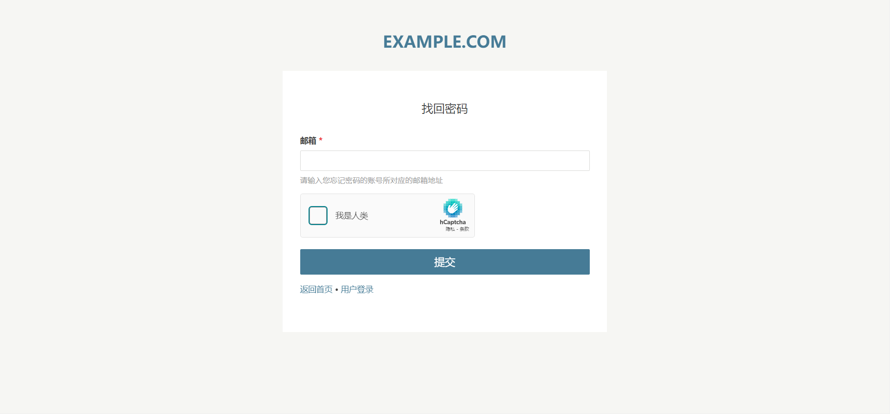

# 🛡️ Passport - Typecho 密码找回插件

> **Passport** 是一款为 Typecho 博客系统设计的安全插件。
>
> 插件提供安全的密码找回与重置功能。插件支持多种主流人机验证方式，内置严格的 Token 管理和 HMAC 签名机制，并且支持高级放爆破功能。本项目遵循 GPLv2 协议，完全免费开源。

[](https://github.com/little-gt/PLUGION-Passport/)
[](https://www.gnu.org/licenses/old-licenses/gpl-2.0.html)
[](https://www.php.net/)
[](https://typecho.org/)
[](https://garfieldtom.cool/)

界面预览：




参与讨论：

[Typecho 官方论坛主题帖](https://forum.typecho.org/viewtopic.php?t=25549)

---

## ✨ 特点概览

| 特性 | 描述 |
| :--- | :--- |
| **高安全令牌机制** | 基于 **HMAC-SHA256** 签名校验，使用**密码学安全随机数**生成令牌，杜绝可预测性和篡改。|
| **防暴力破解** | 基于 IP 的请求速率限制和自动临时封禁，有效抵御暴力破解和邮件滥用。|
| **多重人机验证** | 无缝集成 Google reCAPTCHA v2、hCaptcha 和 Geetest v4，并**强制使用 HTTPS**安全通讯协议。|
| **强密码策略** | 强制要求新密码包含大写、小写、数字及特殊字符。|
| **专业兼容性** | 插件架构遵循 Typecho 最佳实践，兼容 PHP 7.2+ 及 Typecho 1.2+。|
| **可视化管理** | 后台提供风险日志预览和一键解封功能。|

---
## 🚀 近期更新

### 🛠️ 0.1.2-fix 版本优化说明

本次 **`0.1.2-fix`** 版本是一次重要的安全和规范性更新，致力于全面加固插件的底层安全性。

*   **全面安全加固：** 修复了包括弱随机数令牌生成、外部通讯协议不安全（HTTP）、后台 CSRF 缺失等**多个具体实现上不是很严格的地方**。
*   **兼容性与稳定性：** 统一使用 Typecho 框架自带的 **`\Typecho\Http\Client`** 进行网络请求，增强了插件的健壮性。
*   **代码规范提升：** 遵循 Typecho 官方及现代 PHP 编程规范，优化了注释和代码结构，极大提高了可维护性。

**关于本次修复的详细问题和技术细节，请参阅 `SECURITY.md` 文档。**

### 🔮 未来规划

 - 增强 IP 请求的防爆破功能的可视化交互界面功能

---

## ⚙️ 安装指南

完成下面操作，找回密码功能，才能通过路由 `/passport/forgot` 和 `/passport/reset` 访问，并通过登录页面的“忘记密码”按钮访问。

### 📦 安装到 Typecho

1. **下载插件**
   ```bash
   git clone https://github.com/little-gt/PLUGION-Passport.git
   ```
   或直接下载 ZIP 压缩包上传至：
   ```
   /usr/plugins/Passport/
   ```


2. **启用插件**

   * 登录 Typecho 后台 -> 插件 → 启用 Passport - “密码找回插件”

3. **配置插件**

   *  根据提示进入插件配置页面，完成以下关键设置：
   -  配置 **SMTP 服务信息** (用于发送重置邮件)。
   -  选择并配置 **人机验证类型与密钥** (强烈推荐启用)。
   -  检查并保存自动生成的 **HMAC 安全密钥**。

### 📌 集成到登录页

若要在 Typecho 默认登录页 (`admin/login.php`) 添加“忘记密码”链接，请参考以下代码并手动插入到相应模板文件：

```php
// 找到这里 (位于 admin/login.php 底部)
<?php if($options->allowRegister): ?>
&bull;
<a href="<?php $options->registerUrl(); ?>"><?php _e('用户注册'); ?></a>
<?php endif; ?>

// 在其下方插入以下代码
<?php
   $activates = array_keys(Typecho_Plugin::export()['activated']);
   if (in_array('Passport', $activates)) {
       echo '&bull; <a href="' . Typecho_Common::url('passport/forgot', $options->index) . '">' . '忘记密码' . '</a>';
   }
?>
```

---

## 💬 技术支持

如有问题，请访问：
- **问题反馈**：https://github.com/little-gt/PLUGION-Passport/issues
- **作者主页**：https://garfieldtom.cool/

---

**Passport 插件** — 为你的博客添加一个安全强大的密码找回功能。