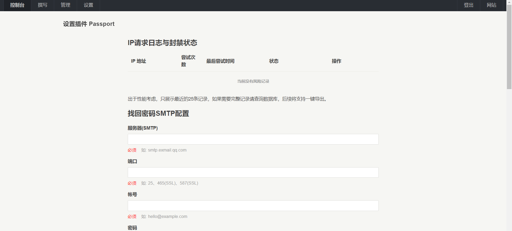

# 🛡️ Passport - Typecho 密码找回插件

[](https://www.gnu.org/licenses/old-licenses/gpl-2.0.html)
[](https://www.php.net/)
[](https://typecho.org/)
[]()
[](https://garfieldtom.cool/)

---

> ✉️ **Passport** 是一个安全可靠的 Typecho 插件，用于为你的博客系统提供 **找回密码、重置密码** 功能，支持多种验证码系统与 SMTP 邮件配置。
> 插件遵循 GPLv2 协议，免费开源。

---

## 📸 截图



---

## ✨ 功能特性

- 🔒 **密码重置令牌系统**（支持 HMAC-SHA256 校验）
- ⚙️ **SMTP 邮件发送配置**（支持 SSL/TLS）
- 🧩 **多验证码支持**：reCAPTCHA、hCaptcha、Geetest v4
- ⏱️ **IP 封禁与速率限制**，防止暴力破解
- 🧰 **自动清理过期令牌**
- 📜 **自定义邮件模板**
- 🧑‍💻 **后台风险日志可视化**
- 🧠 **密码复杂度检测（大写、小写、数字、特殊字符）**

---

## 📦 安装说明

1. 下载最新版本 `Passport.zip`
2. 解压后放置于 `/usr/plugins/Passport/`
3. 后台启用插件
4. 按提示配置以下项目：
    - SMTP 服务信息
    - 验证码类型与密钥
    - HMAC 安全密钥（自动生成）
5. 保存配置，即可使用 `/passport/forgot` 与 `/passport/reset` 页面。
6. 如果你想要在登录页面添加一个“找回密码”的按钮，你可以打开后台模版的“login.php”。并且参考下面的方法添加入口。

``` php
// 找到这里
<?php if($options->allowRegister): ?>
&bull;
<a href="<?php $options->registerUrl(); ?>"><?php _e('用户注册'); ?></a>
<?php endif; ?>

// 在它下面插入以下代码
<?php
   $activates = array_keys(Typecho_Plugin::export()['activated']);
   if (in_array('Passport', $activates)) {
       echo '<a href="' . Typecho_Common::url('passport/forgot', $options->index) . '">' . '忘记密码' . '</a>';
   }
?>
```

---

## ⚙️ 主要配置项

| 分类 | 参数 | 说明 |
|------|------|------|
| SMTP | host, port, username, password, secure | 邮件发送配置 |
| 验证码 | captchaType | 支持 none / recaptcha / hcaptcha / geetest |
| 安全性 | secretKey | HMAC-SHA256 签名密钥 |
| 高级 | enableRateLimit | 启用速率限制 |
| 数据管理 | deleteDataOnDeactivate | 禁用时是否清空数据 |

---

## 🧠 技术亮点

- 安全封禁机制 (`passport_fails` 表)
- 加密签名令牌 (`password_reset_tokens`)
- 支持多语言提示（兼容 `_t()` 翻译函数）
- 使用 `PHPMailer` 发送邮件（嵌入式库，无需依赖）

---

## 🔐 安全提示

- 建议启用 **速率限制** 防止暴力破解。
- 设置强随机的 **HMAC 密钥**。
- 开启 SMTP SSL/TLS 传输。
- 使用 **reCAPTCHA / hCaptcha / Geetest** 提升防护。

---

## 🧾 许可证

本项目采用 [GNU General Public License v2.0](https://www.gnu.org/licenses/old-licenses/gpl-2.0.html)。

Copyright (c) 2025 GARFIELDTOM


---

## 💬 反馈与支持

- 作者博客：[https://blog.garfieldtom.cool/](https://blog.garfieldtom.cool/)
- GitHub Issues：欢迎提交问题或建议
- 邮件支持：coolerxde@gt.ac.cn

---

> **Passport v0.1.1-pre** · “守护你的网站登录安全的第一道防线。”
